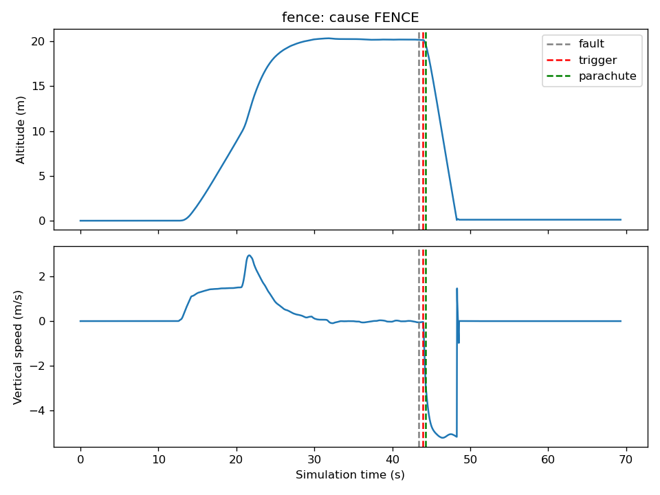
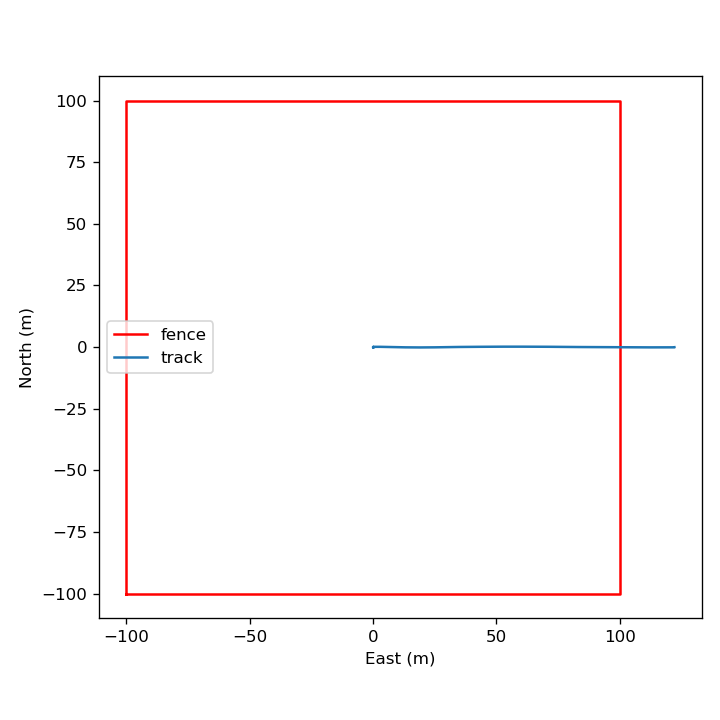

# FTS simulation test log

## 1. Setup

- Date: 2026-09-28.
- Host: UTM VM on a Mac, Ubuntu 22.04 aarch64, 8 cores, 7.7 GB RAM.
- PX4 v1.15.4 SITL (x500), Gazebo `gz sim` 8.15 (Harmonic), ROS 2 Humble.
- FTS: Zephyr v4.4.2 firmware on `native_sim/native/64`; two serial links as PTYs (bridge, ground station).
- FTS demo configuration: fence square +-100 m around the origin (PX4 default home, 47.3979711 N, 8.5461637 E); ceiling 40 m above the arm point. Thresholds from the spec: fence and ceiling confirmation 0.5 s; loss of control over 60 degrees tilt or over 300 deg/s for 0.5 s; autopilot heartbeat (10 Hz) timeout 1.0 s; ground station link timeout 5 s; GNSS fix timeout 1.0 s; parachute 0.3 s after the relay.
- Parachute model: Cd 1.5, area 0.85 m2 (about 5 m/s for the 2 kg drone), wind 3 m/s from the west acting on the parachute drag.
- Every flight: FTS armed on the ground, PX4 takeoff to 20 m, 3 s hover, then the scenario action. All times are simulation time.

## 2. How to reproduce

```sh
tools/sync-vm.sh                    # Mac: copy the tree to ~/fts-sim on the VM
tools/setup-vm.sh                   # VM, once: Zephyr workspace
tools/build-vm.sh                   # VM: firmware, plugin, bridge, ROS 2 packages
tools/run-scenarios.sh fence ceiling control freeze link gnss manual near_fence gnss_jump hb_drop
tools/fetch-runs.sh                 # Mac: copy runs/ back
tools/summarize_runs.py             # the table below
```

## 3. Results

| Scenario | Pass | Cause | Fault to trigger (ms) | Fault to relay (ms) | Fault to parachute (ms) | Altitude at trigger (m) | Descent under parachute (m/s) | Drift (m) | Beyond fence (m) | Max distance from center (m) |
|---|---|---|---|---|---|---|---|---|---|---|
| ceiling | True | CEILING | 544.0 | 544.0 | 844.0 | 41.6 | -5.07 | 24.2 |  | 24.7 |
| control | True | CONTROL | 848.0 | 848.0 | 1148.0 | 17.6 | -5.09 | 7.2 |  | 7.7 |
| fence | True | FENCE | 552.0 | 552.0 | 852.0 | 20.1 | -5.12 | 17.5 | 21.9 | 122.3 |
| freeze | True | AP_FREEZE | 1008.0 | 1008.0 | 1308.0 | 19.9 | -4.88 | 10.8 |  | 12.1 |
| gnss | True | GNSS_LOST | 968.0 | 968.0 | 1268.0 | 20.0 | -4.87 | 10.7 |  | 11.1 |
| gnss_jump | True | NONE |  |  |  |  |  |  |  | 0.2 |
| hb_drop | True | NONE |  |  |  |  |  |  |  | 0.2 |
| link | True | LINK | 5040.0 | 5040.0 | 5340.0 | 19.9 | -5.0 | 10.7 |  | 11.2 |
| manual | True | MANUAL | 68.0 | 68.0 | 368.0 | 19.9 | -5.0 | 10.7 |  | 11.2 |
| near_fence | True | NONE |  |  |  |  |  |  |  | 90.4 |

The relay and parachute columns are the times the FTS commanded them; the bridge acted on each command 0 to 16 ms of simulation time later (its log shows the times). In every terminated run the relay was commanded at the trigger and the parachute 300 ms later; every drone landed; descent under the parachute was 4.9 to 5.1 m/s.

How the fault time is taken: fence and ceiling, the first ground-truth sample past the limit; control and GNSS, the moment the bridge applied the fault; freeze, the last heartbeat the FTS received; link, the last frame the ground station sent; manual, the FTS time when TERMINATE was sent.

## 4. Notes per scenario

- **fence:** flying east at 8 m/s, the drone crossed x = 100 m; the FTS confirmed the breach 0.55 s later at x = 104.4 m (0.5 s confirmation plus the 10 Hz GNSS period). After the motors stopped it kept moving east, and under the parachute the wind carried it further: it landed at x = 121.9 m, 21.9 m outside the fence. Forward speed, confirmation time and wind all add to the distance past the fence, so a real fence needs a margin sized for them.
- **ceiling:** climbing at 2.9 m/s, the drone passed 40 m and was terminated at 41.6 m. From that height the parachute descent took about 8 s, so the 3 m/s wind carried it 24 m downwind.
- **control:** one motor cut at 20 m. The drone rolled over; the tilt passed 60 degrees about 0.35 s after the cut and the FTS confirmed it 0.5 s later. It was falling at 8.5 m/s when the parachute opened, at 17.6 m.
- **freeze:** PX4 was stopped with SIGSTOP. The bridge's heartbeat forwarding stopped with it; the FTS terminated 1.0 s after the last heartbeat. The bridge kept the motors at zero on its own clock, since the frozen PX4 sent no more motor commands, and the drone fell and landed normally under the parachute.
- **gnss:** the bridge stopped the FTS GNSS feed. The FTS terminated 1.0 s after its last fix, which came up to one GNSS period (100 ms) before the feed stopped; this is why the measured time is 968 ms and not over 1000 ms.
- **link:** the ground station stopped sending; the FTS terminated after its 5 s link timeout. The measured 5.04 s includes up to one status period of timestamp lag: the fault time is the newest status time the ground station had when it sent its last frame, not the moment the FTS received that frame.
- **manual:** TERMINATE_ARM and TERMINATE from the ground station; terminated at once (68 ms is the gap to the ground station's last status timestamp, not processing time).
- **near_fence (false alarm):** held at x = 90 m, 10 m inside the fence, for 12 s; no termination.
- **gnss_jump (false alarm):** one GNSS sample 2.2 km north of the drone; the next sample was back inside the fence, so the 0.5 s confirmation never completed; no termination.
- **hb_drop (false alarm):** 5 heartbeats dropped (longest gap 0.6 s against the 1.0 s timeout); no termination.

## 5. Plots

Fence breach: altitude and vertical speed, and the ground track.




One motor cut (loss of control):


Autopilot frozen:


## 6. Limits

- Simulation only. The FTS logic and protocol are the parts meant to carry over to hardware.
- The FTS's own IMU and barometer faults are out of scope; loss of its GNSS fix is covered.
- Wind acts on the parachute drag only, not on the drone in powered flight.
- The parachute model applies drag at the drone's center using the velocity of that point. A drone that is still tumbling under the canopy therefore shows a vertical speed that swings between about 3 and 8 m/s (see the loss-of-control plot); the average is still about 5 m/s.
- One run per scenario. The numbers show the behavior, not a statistical spread.
